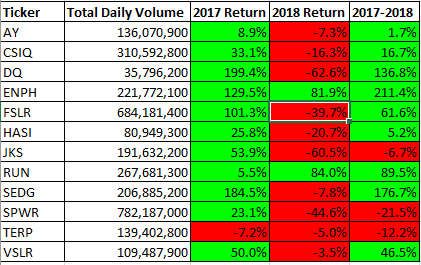

# Following the Trend of Green Stocks

## Overview of Project

### Purpose
Green companies have been sprouting all over as the world shifts to making power through other means. As more and more of these companies sprout, we need to weed out those that underperform and are not worth our time to invest in. With so much information to sort through, we want to be as thorough as possible. I want to present a way to properly sort through a year's worth of trading to see how well these green companies performed on their marks.

## Analysis and Challenges

### Analysis of Green Company Performance
Well, 2017 was a banner year for almost all of those companies. We saw valuations increase from 25% to almost 185%, but we had some less quality candidates that either took a small loss or had less than a 10% value increase. In 2018, we had a proverbial bloodbath. Almost everything was red, but Enphase Energy and Sunrun. That being said, these companies except for JinkoSolar, SunPower, and Terraform Power all had an increase in valuation from 2017 to the end of 2018. The biggest winners were Enphase Energy with a company value increase of over 200% and Solaredge Technologies with an increase of 175%.

### Analysis of Script Performance
Without more data to sift through, we won't really know how well these scripts will perform with a much larger company pool. However, with our current data set, we did see the script efficiently present the data faster.

From our other script, we had slightly longer processing times of 60 to 70 hundreths of a second longer.

### Challenges and Difficulties Encountered
Setting the script to run as an array was a challenge due to how the variables are treated differently than your normal one for one variable type. This array variable needed to ensure each time we did a computation that the variable referenced was also the same array variable and when compiling and debugging, that became really tedious to ensure. That being said, stepping through code helps a lot as it points you to the next error without having to scan manually through the script.

## Results

*- What are the advantages and disadvantages of refactoring code?*

Code refactoring allows for better efficiency across the entire execution of the code. You can find ways to better compress executions and loops, especially as you can grow loops exponentially. However, this efficiency can sometimes lead to inefficiencies especially if you are attempting to refactor legacy code or code written by someone else. A lot of times, we find in the coding world that if something works you usually leave it alone. Though that's bad practice in situations where you just coded something (like this analysis of the stocks), leaving legacy code alone might be better for manhours and your own sanity.

*- How do these advantages and disadvantages apply to the refactor of the stock analysis script?*
Since I had just written the code and was only refactoring some of the calculations, this refactoring was much better for efficiency. We were able to generate the requested data 
